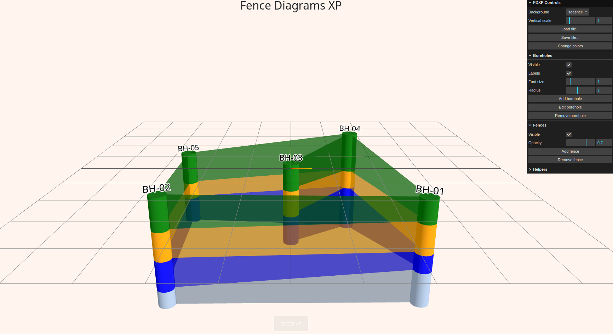

# Fence Diagrams XP
A useful web app based on [threejs](https://threejs.org/) to display 3d fence diagrams for geotechnical visualization.

View the live demo at [xapc2.github.io/fences](https://xapc2.github.io/fences).

## Screenshot

## Quick Start
In progress

### Navigation
+ **Rotate view:** Left click + mouse move
+ **Pan view:** Right click + mouse move
+ **Zoom:** Mouse wheel scroll

### Controls

#### Display Options

#### Adding Elements

#### Deleting Elements

#### Editing Elements

#### Saving the Project

#### Loading a Saved Project 
